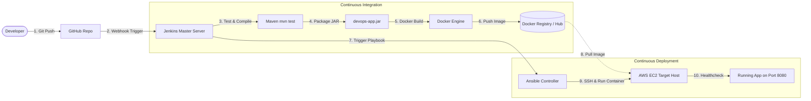

# 🚀 DevOps Project 01: Automated CI/CD Pipeline with Jenkins, Maven, Ansible, Docker & AWS

[](https://github.com)
[](https://www.oracle.com/java/)
[](https://spring.io/projects/spring-boot)
[](https://www.docker.com/)
[](https://www.jenkins.io/)
[](https://www.ansible.com/)
[](https://aws.amazon.com/)

---

## 📌 Project Summary & Key Responsibilities

* **Designed and implemented** an end-to-end automated CI/CD pipeline integrating **GitHub**, **Jenkins**, **Maven**, **Docker**, and **Ansible** on **AWS EC2**.
* **Automated code build, testing, and packaging** workflows using Maven with JUnit test execution and Surefire reporting.
* **Containerized application delivery** via multi-stage Docker builds, publishing versioned artifacts to Docker Hub / Registry.
* **Streamlined configuration management & deployments** using Ansible playbooks for zero-downtime, repeatable rollouts to AWS EC2 instances.
* **Drastically reduced manual deployment overhead** and shortened release cycles through automated GitHub webhook triggers.

---

## 🏗️ Pipeline Architecture



---

## 🛠️ Technology Stack

| Component | Technology | Purpose |
| :--- | :--- | :--- |
| **Source Code Management** | GitHub | Version control and automated webhook triggers |
| **Continuous Integration** | Jenkins | Pipeline orchestration (Declarative Pipeline) |
| **Build & Test Tool** | Apache Maven | Compiling, unit testing (JUnit 5), and JAR packaging |
| **Containerization** | Docker | Multi-stage lightweight JRE container packaging |
| **Configuration Management** | Ansible | Remote provisioning, container lifecycle, and rollouts |
| **Cloud Infrastructure** | AWS EC2 (Ubuntu) | Production and staging host instances |

---

## 📁 Repository Structure

```text
devops-cicd-pipeline/
├── .github/
│   └── workflows/
│       └── ci.yml               # GitHub Actions workflow for automatic PR / Push checks
├── ansible/
│   ├── ansible.cfg              # Ansible execution settings & SSH optimization
│   ├── inventory.ini            # Staging, production, and local target server groups
│   └── deploy.yml               # Automated container deployment playbook with healthchecks
├── aws/
│   └── ec2_setup.sh             # Bootstrap user-data script for AWS EC2 Docker hosts
├── src/
│   ├── main/
│   │   ├── java/com/example/devops/
│   │   │   ├── DevopsApplication.java          # Spring Boot main application class
│   │   │   └── controller/AppController.java   # REST & health check endpoints
│   │   └── resources/
│   │       └── application.properties          # Server port (8080) & Actuator settings
│   └── test/
│       └── java/com/example/devops/
│           └── DevopsApplicationTests.java     # Automated unit & integration tests
├── .dockerignore                # Excludes unwanted files from Docker build context
├── .gitignore                   # Git ignore patterns for Java, target, IDEs, and credentials
├── Dockerfile                   # Multi-stage production container definition
├── docker-compose.yml           # Local multi-container orchestration
├── Jenkinsfile                  # Jenkins Declarative Pipeline script
├── pom.xml                      # Maven project configuration
└── README.md                    # Project documentation
```

---

## ⚙️ Step-by-Step Setup Guide

### 1. AWS EC2 Setup (Target Host)
1. Launch an **AWS EC2 instance** (`t2.micro` or `t2.small`, Ubuntu 22.04 LTS).
2. **Security Group Rules**:
   - Inbound **SSH (Port 22)**: From Jenkins Master IP or your IP.
   - Inbound **Custom TCP (Port 8080)**: From Anywhere (`0.0.0.0/0`) or your ALB.
3. SSH into the instance and run the bootstrap script:
   ```bash
   chmod +x aws/ec2_setup.sh
   ./aws/ec2_setup.sh
   ```

---

### 2. Jenkins Server Configuration

#### Required Jenkins Plugins:
* `Git Plugin`
* `Pipeline`
* `Maven Integration`
* `Docker Pipeline`
* `Ansible Plugin`
* `SSH Agent Plugin`

#### Credentials to configure in Jenkins:
1. **Docker Hub**:
   * ID: `docker-hub-credentials`
   * Type: *Username with password*
2. **AWS EC2 SSH Key**:
   * ID: `aws-ec2-ssh-key`
   * Type: *SSH Username with private key* (Username: `ubuntu`, Private Key: your `.pem` key content)

#### Jenkins Pipeline Job:
1. Create a new **Pipeline** job: `devops-cicd-pipeline`.
2. Select **Pipeline script from SCM**.
3. SCM: **Git**, enter your GitHub Repository URL.
4. Script Path: `Jenkinsfile`.
5. Under Build Triggers, enable **GitHub hook trigger for GITScm polling**.

---

### 3. Ansible Configuration
Update [`ansible/inventory.ini`](ansible/inventory.ini) with your AWS EC2 instance public IP:
```ini
[staging]
staging-server ansible_host=YOUR_AWS_EC2_PUBLIC_IP ansible_user=ubuntu

[production]
prod-server ansible_host=YOUR_AWS_EC2_PUBLIC_IP ansible_user=ubuntu
```

To test the deployment manually with Ansible:
```bash
ansible-playbook -i ansible/inventory.ini ansible/deploy.yml \
  --private-key /path/to/aws-key.pem \
  -u ubuntu \
  --extra-vars "target_env=staging docker_image=yourdockerhubuser/devops-cicd-app:latest"
```

---

### 4. Local Testing with Docker Compose
To run and test the complete application locally without Jenkins:
```bash
# Build and run container
docker compose up -d --build

# Verify health status
curl http://localhost:8080/api/health

# Stop container
docker compose down
```

---

## 🚀 How to Push this Project to Your GitHub

Run the following commands inside this project directory:

```bash
# 1. Initialize Git (if not already initialized)
git init

# 2. Stage all project files
git add .

# 3. Create your initial commit
git commit -m "feat: complete end-to-end CI/CD pipeline with Jenkins, Maven, Ansible, Docker & AWS"

# 4. Link to your GitHub repository
git remote add origin https://github.com/<YOUR_GITHUB_USERNAME>/<YOUR_REPOSITORY_NAME>.git

# 5. Set branch to main and push
git branch -M main
git push -u origin main
```

---

## 🎯 Verification & Endpoints

Once deployed on AWS EC2, access:
* **Root Endpoint**: `http://<AWS_EC2_IP>:8080/`
* **Health Check**: `http://<AWS_EC2_IP>:8080/api/health`
* **Pipeline Info**: `http://<AWS_EC2_IP>:8080/api/pipeline-info`
* **Spring Actuator**: `http://<AWS_EC2_IP>:8080/actuator/health`
